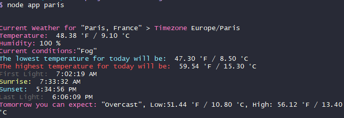
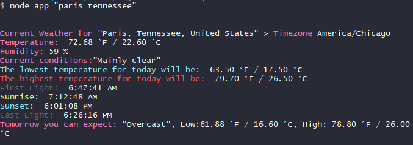

**Your Favorite Weather CLI**

- A simple CLI tool that will return current weather information and a brief forecast.
  



**Quick Overview**

- Once set up, typing ```node app {location_of_your_choice}``` will return the information you requested.
    - Sample command: ```node app berlin```
    - Sample console display: ``` Current Weather for Berlin, Temperature: 82 F/32 C, Humidity: 74%```
    - **Nota bene:** If there are multiple locations with similar names, type your location in quotes to get more exact weather data (ie. ```node app 'paris tennessee'``` to avoid confusion with Paris, France.)



**Set Up Instructions**
- Install the latest version of Node JS.
- Download the project code to your local machine by using the command 
  ```git clone https://github.com/cassiel257/soloproject-tier2-chinguweather.git``` (or clicking the green "Code" button on Github and downloading a zip file).
- Navigate to the project folder using the command line.
- Type in the command ```npm install``` to install any additional dependencies.
- You will need to sign up with two free APIs to receive API keys. They are OpenWeatherMap (https://openweathermap.org/api) and MapBox (https://account.mapbox.com/). These are usually sent to your email shortly after signing up.
- Save these keys in a .env file using the variable names ```WEATHER_API_KEY``` and ```MAPBOX_API_KEY```. Remember not to push your .env file back to your Github account. Make sure that it is listed in the .gitignore folder.
- You should now be able to type in a command like ```node app milan``` and see the weather information printed out for you in the console.

**Questions/Comments**
- Please reach out with any questions, concerns, or suggestions.
